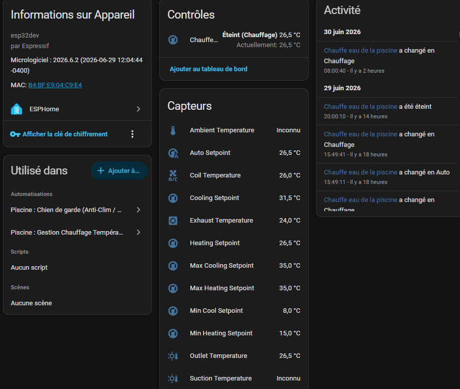
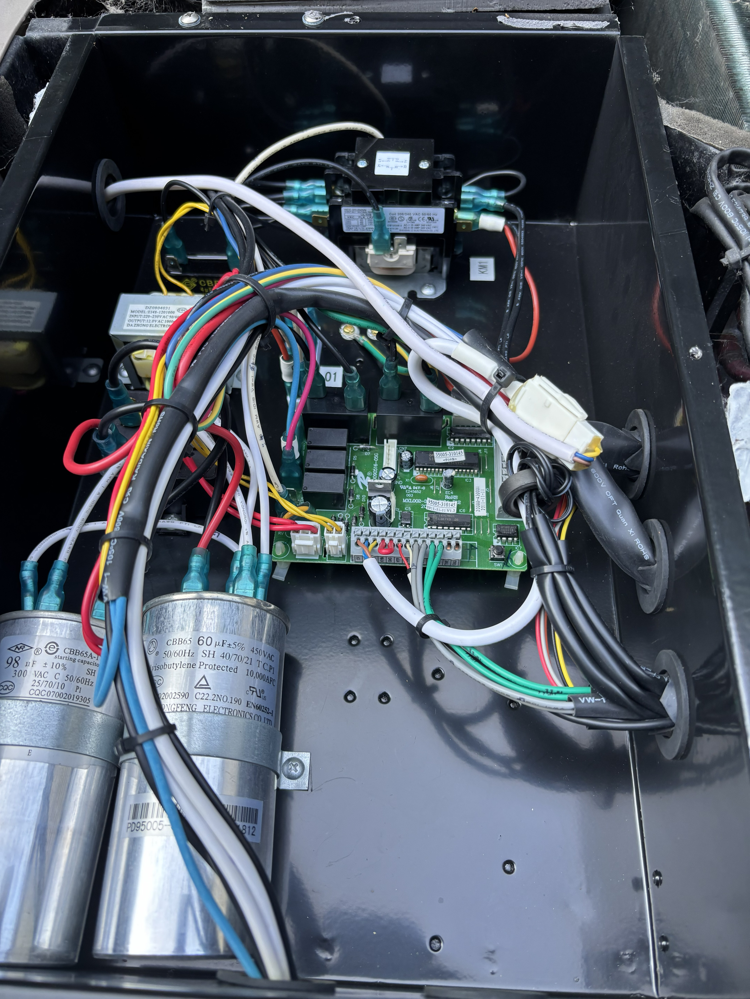
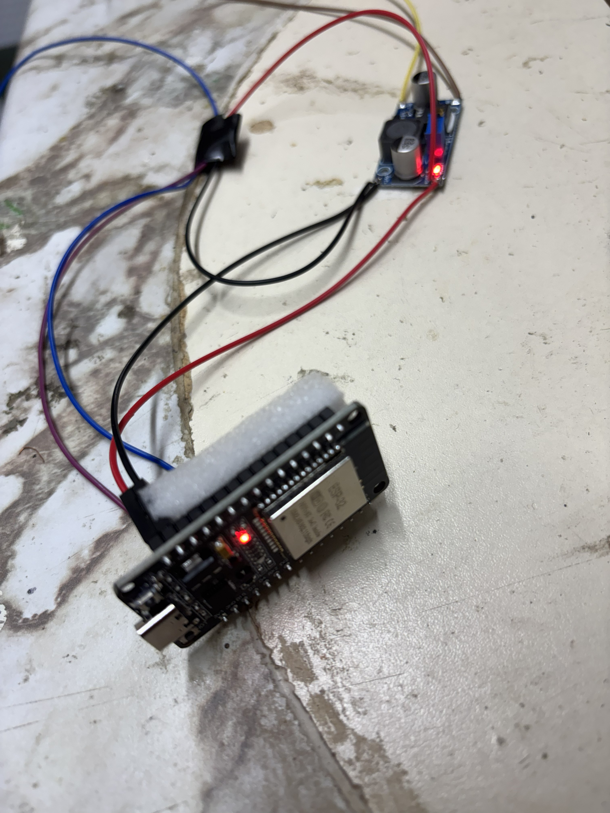

# HP65A PC1000 Compatibility Report

Source: [GitHub discussion #17, "Hayward HP65A board PC1000"](https://github.com/sle118/hayward_pool_heater/discussions/17)

In June 2026, community member `NicDesrochers` reported that the component worked very well with a Hayward HP65A using a PC1000 board. The report identified `hardware-test/esp-idf5-rmt` as the branch used for that installation.

This is a community success report, not a generalized safety guarantee. The discussion did not confirm the voltage-level-shifting arrangement, wiring details, or the scope of Home Assistant control. Treat the attached images as one installation example and continue to follow the project hardware notes, voltage-level requirements, and manual validation procedures.

## Contributor-Supplied Images

## Why This Matters

This report adds a documented HP65A/PC1000 installation to the community compatibility evidence. It is documentation evidence only: it must not be used as a protocol fixture or as proof that new active-control changes are safe without the normal compile, native, fixture, and manual hardware-in-the-loop checks.
